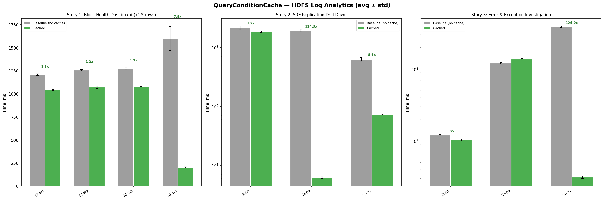

# DuckDB Query Condition Cache

`query_condition_cache` is a DuckDB extension for repeated-query workloads like **metrics monitoring dashboards**, **log investigation**, and other **recurring read paths** where the same filter shows up again and again.

Instead of re-evaluating a predicate across the whole table every time, it remembers which row-group vectors matched before and lets DuckDB skip vectors that are already known to be empty for that predicate.

It is especially useful for repeated `LIKE` searches and other expression-heavy filters that are expensive to revisit.

## Performance

On the HDFS_v2 log analytics benchmark (~71M log lines), `query_condition_cache` reached up to **314.3x faster** repeated-query performance. The biggest gains showed up on selective HDFS log investigation queries, where the same predicate can be reused across runs.



Results depend on predicate selectivity, cache reuse, and the surrounding storage/cache state. Benchmark scripts and methodology live in `[benchmark/README.md](benchmark/README.md)` and `[benchmark/run_hdfs_log_benchmark.py](benchmark/run_hdfs_log_benchmark.py)`.

## Usage

```sql
LOAD 'query_condition_cache';

CREATE TABLE t AS
SELECT i AS id, i % 100 AS val, 'msg_' || (i % 10) AS msg
FROM range(500000) t(i);
```

You can either build the cache yourself for a known predicate, or let the optimizer do it on demand.

### Manual Cache Build

If you already know the filter you care about, build a cache entry directly for that table/predicate pair:

```sql
SELECT * FROM condition_cache_build('t', 'val = 42 AND msg LIKE ''%2''');
SELECT * FROM condition_cache_info('t', 'val = 42 AND msg LIKE ''%2''');
```

`condition_cache_info` returns:

- `cached_row_groups`
- `total_row_groups`
- `qualifying_vectors`
- `total_vectors`

### Automatic Cache Build And Apply

If you prefer not to manage cache entries manually, the optimizer path is enabled by default:

```sql
SET use_query_condition_cache = true;

SELECT count(*) FROM t WHERE val = 42;
SELECT * FROM condition_cache_info('t', 'val = 42');
```

On a cache miss, the optimizer builds the cache inline for supported filtered table scans. On later queries, it injects a `ROW_ID`-backed filter so cached-empty vectors can be skipped. Setting `use_query_condition_cache = false` disables the optimizer path and clears cached entries.

## How It Works

Under the hood, the extension does five things:

- Canonicalizes the predicate into a stable cache key
- Scans only referenced columns plus `ROW_ID`
- Records which vectors inside each row group contain qualifying rows
- Stores entries in DuckDB's per-database `ObjectCache`
- Treats uncached row groups as pass-through for correctness

## Roadmap

- [ ] Parquet predicate scan cache support

## Development

```sh
GEN=ninja make
make test
./build/release/test/unittest --test-dir . "test/sql/condition_cache_auto.test"
```
